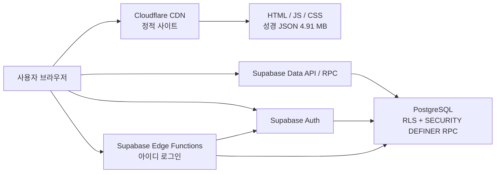
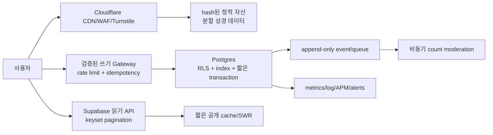

# CommentBible Production Upgrade Plan

- 상태: `audited candidate` — 분석 및 변경 설계만 완료, 운영 코드·DB·Supabase·Cloudflare 설정 변경 없음
- 기준 시각: 2026-08-10 (Asia/Seoul)
- 목표: 동시 접속 10,000~50,000명 이상
- 분석 대상: 운영 프론트 산출물, Git 저장소, Supabase Database/Auth/Storage/Realtime/API/Edge Functions, 공개 Cloudflare/CDN 응답

## 0. 결론

현재 구조를 **동시 접속 1만~5만 명을 안정적으로 처리할 수 있는 구조라고 승인할 수 없다.** 정적 HTML·CSS·JS는 Cloudflare가 상당 부분 흡수할 수 있지만, 동적 요청은 브라우저에서 Supabase로 직접 전달된다. 댓글·로그인·중복확인·게시판 요청은 Cloudflare 사이트 WAF를 우회하며, 서버 측 쓰기 제한과 부하 격리가 부족하다.

특히 다음 네 가지가 규모 확장의 선행 차단 조건이다.

1. 운영 Supabase가 Free/nano, DB 최대 연결 60, 백업 없음 상태다.
2. 구형 댓글 조회가 실제 실행계획에서 `Seq Scan`이며 `(verse_id, created_at, id)` 인덱스가 없다.
3. 익명 댓글·반응·신고·조회수 RPC에 공격자가 바꿀 수 없는 서버 측 rate limit이 없다.
4. 아이디 로그인 Edge Function이 로그인마다 Auth 사용자 목록을 최대 10,000명까지 순회한다. 별도로 배포된 가입 중복확인 함수는 최대 50,000명을 순회한다.

현재 데이터가 매우 작아 평균 응답 시간이 짧은 것은 확장성 근거가 아니다. 운영 통계상 `bible_verses` 약 31,126행, 구형 `comments` 약 33행, `board_posts` 약 16행, `discussion_comments` 약 7행 수준이다.

## 1. 현재 아키텍처 분석



### 1.1 Frontend·배포

- 정적 HTML/CSS/vanilla JavaScript를 Cloudflare에서 제공한다.
- 운영 reader는 시작 시 `/data/bible-kor.json` 전체를 내려받아 브라우저 메모리에서 정규화한다.
- 브라우저가 Supabase Data API, RPC, Auth, Edge Functions에 직접 연결한다.
- 운영에 배포된 `reader-app.js`, `community.js`, `admin.js`와 Edge Function 원본은 기존 Git `main`에 완전하게 재현되지 않았고, 별도 복구본과 production candidate가 생성된 상태다.
- 자동 배포 이력, 승인 게이트, DB migration 연동을 증명하는 단일 CI/CD 경로가 없다.

### 1.2 Backend·API

- 별도 애플리케이션 서버 없이 Supabase Data API와 PostgreSQL RPC가 backend 역할을 한다.
- 읽기는 공개 view 또는 테이블, 쓰기는 `SECURITY DEFINER` RPC와 일부 직접 insert를 혼용한다.
- `discussion_comments_public`와 `board_posts_public` view는 `security_invoker=true`로 확인되어 view 자체가 RLS를 우회하지는 않는다.
- Realtime publication에는 등록된 테이블이 없고 프론트에도 채널 구독이 없다. 현재는 WebSocket 대량 연결 문제가 없다.
- Storage bucket은 생성되어 있지 않다. 현재 서비스 핵심 경로에서 Storage는 사용하지 않는다.

### 1.3 Supabase 현재 용량·운영 상태

| 항목 | 실제 확인값 | 판정 |
|---|---:|---|
| 플랜/compute | Free / nano | 운영·대규모 트래픽 부적합 |
| DB `max_connections` | 60 | 직접 연결·관리 작업 포함 여유가 작음 |
| `statement_timeout` | 120초 | 폭주 시 느린 요청이 자원을 오래 점유할 수 있음 |
| 백업 | Free 프로젝트에서 백업 없음 | P0 데이터 복구 위험 |
| DB migration 기록 | Dashboard 기준 없음 | schema drift 위험 |
| Read replica | 없음 | 읽기 격리 없음 |
| Log Drain | 없음 | 장기 검색·경보·사고 분석 한계 |
| Realtime publication | 0개 테이블 | 현재 불필요한 Realtime 비용은 없음 |
| Storage bucket | 0개 | 현재 영향 없음 |
| Edge Functions | 2개 | 소스·rate limit·관측성 개선 필요 |

관찰 시점의 CPU 약 2%, RAM 약 47%, disk 약 15%, 연결 5/60은 현재 저부하 스냅샷일 뿐 10k~50k 용량 증명이 아니다.

## 2. Supabase Database DDL·RLS 조사 결과

### 2.1 public relation inventory

모든 public base table에서 RLS가 활성화되어 있었다. `FORCE ROW LEVEL SECURITY`는 사용하지 않는다.

| relation | 핵심 컬럼·용도 | 현재 인덱스/문제 |
|---|---|---|
| `admin_posts` | 관리자 게시물 | RLS 있음 |
| `admin_users` | 관리자 사용자 매핑 | RLS 있음 |
| `bible_verses` | `id`, `book_key`, `chapter`, `verse`, `content`, `sort_order` | `(book_key, chapter, verse)` unique 및 별도 중복 index 존재 |
| `board_posts` | 게시글 본문·카운터·soft delete | `(board_type, is_pinned desc, created_at desc) WHERE deleted_at IS NULL`; board_type 없는 전체 목록에는 부적합 |
| `bookmarks` | 사용자별 절 책갈피 | `(user_id, verse_id)` unique, 사용자 시간순 index 있음 |
| `comment_reactions` | 구형 댓글 반응 | 핵심 조회 인덱스 추가 검토 필요 |
| `comments` | 구형 절 댓글 | PK와 작성자 index만 있음. `verse_id` 조회 index 없음 |
| `discussion_comments` | 통합 댓글/대댓글 | `(target_key, created_at) WHERE deleted_at IS NULL`; cursor tie-breaker `id` 없음 |
| `discussion_reactions` | target별 반응 | `(target_key, reaction_type, actor_key)` PK |
| `discussion_reports` | 신고 | target/actor unique 구성 중복 존재 |
| `discussion_views` | 조회 actor dedupe | `(target_key, actor_key)` PK |
| `highlights` | 구형 사용자 하이라이트 | `user_verse_marks`와 기능 중복 |
| `member_identities` | 정규 username/nickname | 대소문자 무시 unique index 존재 |
| `member_nickname_blocklist` | 닉네임 금칙어 | `(normalized_term, match_mode)` unique |
| `profiles` | display name | `member_identities`와 책임 중복 |
| `user_preferences` | 글꼴·테마 | 사용자 PK |
| `user_verse_marks` | bookmark/highlight/memo 통합 | `(user_id, verse_id)` PK |
| `verse_notes` | 별도 절 노트 | `(user_id, verse_id)` unique, 사용자 수정시간 index |
| `verse_reactions` | 절 반응 | 절/시간, 익명ID/시간, unique index 있음 |
| `board_posts_public` | 공개 게시글 view | `security_invoker=true` |
| `discussion_comments_public` | 공개 댓글 view | `security_invoker=true` |

### 2.2 무결성·구조 문제

- `comments.verse_id`는 문자열이며 `bible_verses.id` FK가 없다. 잘못된 절 ID가 저장될 수 있다.
- `target_key`는 여러 종류의 대상을 문자열로 합성한다. 정규식·대상 존재 검증과 타입 분리가 부족하다.
- `comments`와 `discussion_comments`, `bookmarks/highlights/verse_notes`와 `user_verse_marks`, `profiles`와 `member_identities`가 중복 책임을 가진다.
- 게시글의 `view_count`, `reaction_count`, `comment_count`는 hot row가 될 수 있다. 이벤트마다 동일 행을 갱신하면 lock contention이 발생한다.
- 공개 역할에 테이블 수준 권한이 넓게 부여되어 있다. RLS가 현재 방어하지만 최소 권한 원칙에 맞게 `REFERENCES/TRIGGER/TRUNCATE` 등 불필요 grant를 회수해야 한다.
- `verse_reactions`에 중복된 공개 insert 정책이 있고 허용 enum이 `comforted/strengthened`와 `comfort/strength`로 불일치한다. 기능 오류와 정책 drift를 만든다.

### 2.3 RLS 정책 판정

확인된 긍정 사항:

- public base table RLS 활성화.
- 사용자 marks/preferences/notes/profiles는 `auth.uid() = user_id/id` 소유권 조건 사용.
- 공개 view는 security invoker.
- 주요 `SECURITY DEFINER` 함수는 고정 `search_path`를 사용한다.
- public 함수 본문에서 동적 SQL `EXECUTE` 사용은 발견되지 않았다.
- 관리자·삭제 보관함 RPC의 비로그인 호출은 차단된다.

개선 사항:

- `auth.uid()`를 정책 행마다 재평가하는 정책은 가능한 경우 `(select auth.uid())`로 고정하고 소유권 컬럼 index를 확인한다.
- `TO public`과 `anon` 정책이 중복된 legacy 정책을 정리한다.
- 익명 insert 정책은 형식·길이만 확인하며 실제 rate limit과 사람 여부를 보장하지 않는다.
- 함수별 `EXECUTE` 권한을 `anon`, `authenticated`, `service_role`에 명시적으로 재설계한다.
- `member_identities`와 blocklist는 직접 policy가 없고 definer RPC를 통한다. 이 방식은 유지 가능하지만 RPC 입력·출력·호출량 제한이 필수다.

## 3. 실제 Query·PostgreSQL 실행계획 분석

### 3.1 성경 데이터

- 운영 브라우저는 DB가 아니라 정적 JSON 전체를 먼저 받는다.
- 원본 크기: 4,910,700 bytes.
- 매 첫 방문에서 전체 JSON parse, 전체 트리 정규화, 검색/lookup용 순회가 발생한다.
- 운영 코드는 `cache:'no-store'`; 공개 응답은 `Cache-Control: public, max-age=0, must-revalidate`다.
- Cloudflare edge는 `HIT`이지만 브라우저는 매번 재검증하고, 단말은 전체 parse·메모리 비용을 부담한다.

### 3.2 댓글 조회

구형 절 댓글의 실제 계획:

```text
Limit
  Sort Key: created_at DESC
  Seq Scan on comments
    Filter: deleted_at IS NULL AND verse_id = ANY (...)
```

원인은 `comments(verse_id, created_at, id)` index 부재다. 데이터가 33행일 때는 싸지만 댓글이 누적되면 절을 열 때마다 전체 댓글 테이블을 훑는다.

통합 댓글의 실제 계획:

```text
Index Scan Backward using discussion_comments_target_idx
  Index Cond: target_key = '...'
```

현재 target 조회는 index를 타지만 `(created_at, id)` 안정 cursor가 없고, 운영 코드는 페이지 cursor 없이 전체 또는 큰 window를 가져온다.

### 3.3 게시글 조회

전체 게시글 목록의 실제 계획:

```text
Limit
  Sort Key: is_pinned DESC, created_at DESC
  Seq Scan on board_posts
    Filter: deleted_at IS NULL
```

현재 partial index의 첫 컬럼이 `board_type`이라 `board_type` 조건 없는 전체 목록에는 사용할 수 없다. 운영 community는 최대 500건 `select('*')` 후 브라우저에서 검색·필터·페이지 처리한다. production candidate가 컬럼과 window를 제한했지만 keyset pagination은 아직 없다.

### 3.4 누적 통계

- `pg_stat_statements`는 활성화되어 있다.
- 현재 공개 댓글·통합 댓글 읽기의 관측 평균은 대략 1ms 전후이나 데이터량과 호출량이 매우 작다.
- 익명 댓글 insert는 관측 샘플에서 수 ms~수십 ms 편차가 있다.
- 이 통계는 성장 후 cardinality, hot key, 쓰기 폭주, 10k 동시성 상황을 재현하지 않는다.

## 4. 병목 지점 분석

| 병목 | 현재 원인 | 10k~50k 영향 |
|---|---|---|
| 초기 성경 로딩 | 4.91MB 전체 JSON + 전체 parse | 모바일 CPU/메모리, 초기 전송량 급증 |
| 구형 댓글 조회 | verse index 없음 | 데이터 증가에 따라 선형 scan |
| 게시글 목록 | 500건 전체 본문 + client filter | DB 전송량·브라우저 메모리·DOM 증가 |
| 댓글 pagination | cursor 없음 | 인기 절/게시글의 무제한 응답 |
| fallback | view → RPC → legacy table 순차 시도 | 장애 시 요청 증폭과 DB 부하 증폭 |
| 로그인 | 매 요청 Auth 사용자 최대 10k scan | O(N), service-role 관리 API 집중 |
| 미사용 중복확인 함수 | 최대 50k 사용자 scan | 공개 공격 표면, O(N) 비용 |
| 익명 쓰기 | localStorage actor ID 신뢰 | ID 재발급으로 제한 우회, DB 직접 폭주 |
| view counter | 동기 hot-row 갱신 가능성 | 인기 게시글 row lock 경쟁 |
| DB compute | Free/nano, 60 connections | burst 흡수·관리 여유 부족 |
| 관측성 | 장기 log drain/APM/경보 없음 | 장애 원인 파악과 자동 대응 지연 |

## 5. 보안 취약점 분석

### 5.1 P0/P1 위험

1. `http://commentbible.com/`이 HTTPS redirect 없이 HTTP 200을 반환한다. HTTPS 응답에 HSTS도 없다. 최초 접속 MITM 위험이 남는다.
2. Supabase 조직 owner 계정 MFA가 비활성화되어 있다. 관리 계정 탈취 시 DB/Auth/secret 전체가 위험하다.
3. Auth 최소 비밀번호 길이가 6이고 문자 조합 요구가 없다. Secure password change와 현재 비밀번호 요구도 비활성화되어 있다.
4. `login-by-username`은 service role로 전체 사용자 목록을 순회하고 세션 토큰을 응답한다. CORS가 `*`이며 애플리케이션 자체 IP+username rate limit/Turnstile이 없다.
5. 로그인 함수 파일 앞부분에 기본 템플릿 handler가 남아 있어 실제 로직과 혼재한다. 소스 재현성과 배포 검증이 약하다.
6. 사용되지 않는 `check-signup-availability` Edge Function이 공개 배포되어 있고 service role로 최대 50,000 사용자를 순회한다.
7. 익명 댓글·반응·신고·조회 actor는 클라이언트 localStorage 값이다. 공격자는 값을 계속 바꿀 수 있다.
8. Cloudflare는 정적 사이트 도메인을 보호하지만, 브라우저가 직접 호출하는 Supabase 도메인 API에는 그 zone의 WAF/rate rule이 적용되지 않는다.
9. Free 프로젝트는 운영 백업이 없다. 보안 사고나 실수 후 복구 보장이 없다.

### 5.2 XSS·SQL Injection 판정

- 댓글 본문, 작성자명, 성경 본문 등 동적 문자열은 확인한 운영 렌더링 경로에서 `escapeHtml` 또는 `textContent`를 사용한다. 즉시 악용 가능한 stored XSS는 발견하지 못했다.
- CSP, `frame-ancestors 'none'`, `X-Frame-Options: DENY`, `nosniff`, 제한적 Permissions-Policy가 적용되어 있다.
- CSP의 `style-src 'unsafe-inline'`과 외부 CDN script 허용은 장기적으로 축소해야 한다.
- 브라우저 query builder/RPC parameter를 사용하고 public 함수에서 동적 SQL이 발견되지 않아 SQL injection 위험은 낮다.
- 위 판정은 “취약점 없음”이 아니라 확인한 경로에서 직접 문자열 SQL과 미이스케이프 출력이 없다는 의미다. 보안 회귀 테스트는 계속 필요하다.

### 5.3 Auth의 긍정 설정

- 이메일 확인이 켜져 있다.
- secure email change가 켜져 있다.
- 익명 Auth sign-in은 꺼져 있다.
- Auth 자체 sign-up/sign-in rate limit은 IP당 5분 30회, token refresh는 IP당 5분 150회로 설정되어 있다.
- Site URL은 production origin이고 redirect allowlist는 같은 origin 하위 경로다.

## 6. 프론트엔드 성능 문제

1. 성경 전체 JSON을 초기 진입 차단 경로에서 다운로드·parse한다.
2. 반복 `flatMap`, 전체 절 배열 생성, 선형 `find`가 저사양 단말 GC와 검색 지연을 만든다.
3. 운영 reader 댓글에는 안정적인 cursor pagination이 없다.
4. 운영 community는 게시글 500건 전체 본문을 내려받고 client-side 검색·필터·페이지를 수행한다.
5. 글 상세 댓글도 페이지 제한 없이 증가할 수 있다.
6. capability fallback이 장애 중 2~3배 API 호출을 만들 수 있다.
7. 모든 정적 자산이 `max-age=0, must-revalidate`라 content hash 기반 장기 browser cache를 활용하지 못한다.
8. Supabase SDK가 CDN에서 로드된다. 버전 고정은 되어 있으나 self-host/SRI/lockfile 기반 공급망 재현성이 더 낫다.
9. user marks는 로그인 후 해당 사용자의 전체 marks를 읽는다. 장기 사용자 데이터가 커지면 현재 절 범위 또는 변경분 동기화가 필요하다.

## 7. Supabase 설정 문제

| 영역 | 현재 | 개선 |
|---|---|---|
| 플랜 | Free | 최소 Pro; 부하 시험에 따라 Medium/Large compute |
| 백업 | 없음 | daily backup + PITR 또는 검증된 외부 논리 백업 |
| migration | Dashboard 이력 없음 | 저장소 migration을 유일한 변경 경로로 고정 |
| Auth 비밀번호 | 최소 6, 조합 없음 | 최소 10~12, 조합 정책, leaked password protection |
| 관리자 MFA | 비활성 | owner/admin 전원 MFA 강제 |
| Edge Functions | dashboard-only 소스, O(N) scan | Git 관리, index/RPC 기반 O(log N), rate limit/Turnstile |
| Realtime | publication 없음 | 현재 유지. 필요할 때만 제한된 Broadcast 도입 |
| Storage | bucket 없음 | 현재 유지. 도입 시 private 기본·MIME/크기/path RLS |
| DB timeout | statement 120초 | API별 짧은 timeout, idle/lock timeout 설계 |
| observability | 기본 Dashboard 로그 | error/APM, 외부 alert, DB·Auth·Edge 지표 통합 |
| grants | API 역할에 광범위한 table privileges | 필요한 SELECT/INSERT/UPDATE/DELETE만 명시 |

## 8. 수만 명 접속 대비 필요한 개선 목록

### 8.1 목표 구조



### 8.2 필수 개선

- 성경 데이터를 book/chapter 단위 content-hash 파일로 분할하고 현재 장+인접 장만 prefetch.
- 정적 자산은 hash 파일명 + `max-age=31536000, immutable`; HTML만 즉시 재검증.
- 댓글·게시글·보관함 전부 `(created_at, id)` keyset pagination.
- `comments(verse_id, created_at DESC, id DESC) WHERE deleted_at IS NULL` index 추가.
- `discussion_comments(target_key, created_at DESC, id DESC) WHERE deleted_at IS NULL`로 cursor index 보강.
- 전체 board 목록 전용 `(is_pinned DESC, created_at DESC, id DESC) WHERE deleted_at IS NULL` 또는 query에 `board_type` 강제.
- 로그인 username을 Auth user list scan이 아닌 authoritative table unique index로 조회.
- 쓰기 요청에 IP+account/device+target 기반 quota, Turnstile, idempotency key, 짧은 transaction 적용.
- view/reaction/comment count는 append-only event 후 비동기 집계하거나 shard counter 사용.
- P0 observability: DB CPU/IO/connections, API p95/p99/5xx, Auth 실패, Edge latency, rate-limit hit, queue depth 경보.
- staging에서 1k→5k→10k→25k→50k 단계 부하 시험 후 compute 확정.
- RTO/RPO 정의, restore drill, 담당자 primary/secondary, incident runbook 마련.

## 9. 수정 우선순위 P0~P3

### P0 — 운영 안전성 선행 조건

| 작업 | 변경 파일/설정 | 예상 효과 | 위험 | 테스트 |
|---|---|---|---|---|
| 운영 소스 단일화 | 복구본 → 정식 release branch, Edge source 추가 | 재현·rollback 가능 | 잘못된 artifact 채택 | 운영 hash 비교, staging smoke |
| HTTPS 강제·HSTS 단계 적용 | Cloudflare zone, `_headers` | MITM 차단 | 잘못된 HSTS 장기 영향 | HTTP 301/308, 모든 subdomain 점검 |
| owner/admin MFA | Supabase account/org | 관리 계정 탈취 완화 | 복구 코드 관리 | 보조 관리자 로그인·복구 훈련 |
| Pro+백업 전환 | Supabase billing/backup | pause·데이터 손실 위험 감소 | 월 비용 증가 | 복원 리허설 |
| 로그인 함수 교체 | `supabase/functions/login-by-username/index.ts` | O(N) 제거, abuse 방어 | 로그인 회귀 | 정상/오류/폭주/토큰 로그 마스킹 |
| 익명 쓰기 제한 | 새 Edge gateway 또는 private RPC+quota table | 댓글 폭주 차단 | false positive | burst, actor 재발급, 동시성 시험 |
| RLS/GRANT/함수 ACL 정리 | 새 timestamped migration | 최소 권한 | 정책 실수로 서비스 중단 | anon/auth/admin/service role matrix |
| legacy 댓글 index | 새 migration | Seq Scan 제거 | index build IO | staging EXPLAIN, production concurrent build |
| 관측·경보 | Supabase metrics + 외부 APM/alert | 장애 감지 | 비용/노이즈 | synthetic alert drill |

### P1 — 10k 진입 조건

- 게시글·댓글·보관함 keyset pagination.
- 성경 데이터 분할 및 hash cache.
- capability fallback을 배포 manifest로 결정하고 circuit breaker 추가.
- 게시글 list query/index 정렬 일치.
- `profiles/member_identities`, marks/notes 중복 모델의 authoritative source 확정.
- 미사용 `check-signup-availability` Edge Function 제거 또는 private 전환.
- 10k 혼합 부하 시험 통과: 정적 cold/warm, hot verse read, 댓글 burst, login burst 분리.

### P2 — 25k~50k 진입 조건

- count/조회수 비동기 집계.
- read-heavy API의 짧은 TTL·SWR·ETag 전략.
- 부하 결과에 따른 Large compute/read replica/지역 전략.
- CSP에서 inline style 축소, SDK self-host/SRI.
- chaos/restore/rollback drill과 비용 경보.

### P3 — 장기 최적화

- 검색 전용 FTS/GIN 도입.
- 데이터 보존·익명 식별자 rotation·soft-delete purge 정책.
- 폰트 subset과 저사양 단말 렌더 최적화.
- 실제 지표 기반 compute down/up sizing과 비용 최적화.

## 10. 변경 파일 계획

아래 표는 최초 진단 당시의 변경 계획이다. 이후 사용자가 수정을 승인해 구현·적용한 상태는 16절을 기준으로 판단한다.

| 파일/설정 | 예정 변경 |
|---|---|
| `production-candidate/reader-app.js` | 성경 분할 loader, 댓글 cursor, 요청 취소, fallback circuit breaker |
| `production-candidate/community.js` | 게시글/댓글 keyset pagination, 본문 지연 조회, server-side filter |
| `production-candidate/admin.js` | 보관함 cursor pagination |
| `data/manifest.json` 및 분할 데이터 | content hash, book/chapter shard |
| `supabase/functions/login-by-username/index.ts` | Git 관리, indexed lookup, Turnstile/rate limit, 제한 CORS |
| `supabase/functions/write-gateway/index.ts` 후보 | 익명 쓰기 quota/idempotency |
| `supabase/migrations/<timestamp>_production_hardening.sql` | index, RLS, grant, ACL, quota/idempotency schema |
| `_headers` | cache 정책, 단계적 HSTS, CSP 조정 |
| Cloudflare zone | Always Use HTTPS, WAF, rate rule, Turnstile, cache rules |
| CI workflow | lint/test/migration dry-run/staging deploy/canary/rollback |
| monitoring runbook | SLO, alert threshold, incident/restore 절차 |

기존 `20260809103936_harden_comments_mvp.sql`은 실제 운영 schema와 불일치한다. 존재하지 않는 legacy object를 전제로 하므로 **운영에 실행하면 안 된다.** 실제 migration은 아래 설계를 기준으로 새 timestamp 파일로 작성해야 한다.

## 11. DB 변경 SQL 초기 설계안 — 적용 상태는 16절 참조

아래 SQL은 최초 방향을 명시한 초안이다. 이 중 조회 index와 서버 전용 제한 구조 등 실제 적용된 항목은 별도 timestamp migration과 16절의 운영 검증 기록이 기준이다. 역할 권한 축소처럼 아직 배포 순서가 필요한 항목은 그대로 미적용 상태다.

```sql
-- 1) 현재 Seq Scan인 절 댓글 조회
create index concurrently if not exists comments_visible_verse_cursor_idx
  on public.comments (verse_id, created_at desc, id desc)
  where deleted_at is null;

-- 2) 안정적인 통합 댓글 cursor
create index concurrently if not exists discussion_comments_visible_cursor_idx
  on public.discussion_comments (target_key, created_at desc, id desc)
  where deleted_at is null;

-- 3) board_type 없는 전체 목록을 계속 지원할 경우
create index concurrently if not exists board_posts_public_cursor_idx
  on public.board_posts (is_pinned desc, created_at desc, id desc)
  where deleted_at is null;

-- 4) API 역할 최소 권한 예시: 실제 사용 matrix 확인 후 적용
revoke references, trigger, truncate on all tables in schema public
  from anon, authenticated;

-- 5) 중복/불일치 정책은 drop 후 하나의 명시적 정책으로 재생성
-- 6) SECURITY DEFINER 함수는 PUBLIC execute를 revoke하고 역할별 grant
-- 7) rate limit/idempotency는 attacker-controlled anonymous_id만 믿지 않음
```

`CREATE INDEX CONCURRENTLY`는 transaction block 안에서 실행할 수 없으므로 migration runner 전략을 별도로 정해야 한다. 작은 staging에서 일반 index를 검증한 뒤 production에서는 lock·IO·rollback 기준을 포함해 적용한다.

## 12. Cache·Rate Limit 전략

### Cache

| 대상 | Browser TTL | Edge TTL | 규칙 |
|---|---:|---:|---|
| HTML | 0, revalidate | 1~5분 | 배포 반영 우선 |
| hash JS/CSS | 1년 immutable | 1년 | 파일명 hash 필수 |
| hash 성경 shard | 1년 immutable | 1년 | 내용 변경 시 새 URL |
| 공개 게시글/댓글 read | 기본 no-store 또는 2~10초 SWR | 선택 | 개인 필드 없는 view만 |
| Auth/개인 marks/write | no-store | bypass | 공유 cache 금지 |

### Rate Limit

- 로그인: IP + normalized username, sliding window, exponential delay, Turnstile 단계 상승.
- 댓글: IP/계정 + device cookie + target, 10초/10분/1일 다중 창, idempotency key.
- 반응·조회수: target+actor unique와 서버 quota 병행.
- 신고: actor+target unique, IP quota, 반복 악성 actor 차단.
- 차단 상태를 Postgres hot table 하나에 매 요청 갱신하지 말고 edge KV/분산 limiter 또는 적절히 partition된 quota store 사용.
- Supabase 직접 endpoint를 유지하면 DB/RPC 내부 제한이 최종 방어선이다. Cloudflare rule만으로 충분하지 않다.

## 13. 테스트 방법과 승인 게이트

### 13.1 기능·보안

- anon/authenticated/admin/service role별 SELECT/INSERT/UPDATE/DELETE/RPC 허용·거부 matrix.
- 다른 사용자 marks/profile 접근 IDOR/BOLA negative test.
- 댓글/작성자/검색에 HTML·SVG·event handler payload 저장 후 무해한 text 렌더 확인.
- SQL meta-character를 모든 RPC parameter에 전달해 동적 SQL 부재 확인.
- 로그인 enumeration timing, brute force, token·password log 노출 검사.
- Turnstile 실패·우회·재사용, idempotency replay, actor ID rotation 시험.

### 13.2 성능

- EXPLAIN에서 댓글·게시글 조회가 목표 index scan인지 확인.
- 1k→5k→10k→25k→50k virtual users 단계 시험.
- 시나리오를 정적 읽기, API 읽기, hot target 읽기, 댓글 burst, Auth burst로 분리.
- 성공 기준 예시: read p95 < 500ms, write p95 < 800ms, 5xx < 0.1%, DB CPU 지속 < 70%, connection < 70%, lock wait/queue 무증가.
- CDN cache hit ratio, origin egress, 브라우저 LCP/INP, 저사양 Android 메모리 측정.

### 13.3 장애·복구

- DB timeout, Edge Function 실패, Auth 지연, Cloudflare cache purge를 각각 주입.
- fallback은 무한 재시도 없이 backoff/circuit open 되는지 확인.
- backup에서 별도 staging project로 복원하고 RTO/RPO를 기록.
- canary 1%→10%→50%→100%, 각 단계 자동 rollback 기준 설정.

## 14. 예상 비용과 운영 구조

2026-08-10 공식 공개 요금 기준이다. 실제 비용은 MAU, egress, DB CPU/IO, 로그량, Realtime 사용 여부에 따라 달라진다.

Supabase 공식 기준:

- Pro: 월 $25부터, Micro compute $10 credit 포함.
- Small $15, Medium $60, Large $110/월 compute.
- Pro 합계 예: Medium은 대략 `$25 + $60 - $10 = $75/월`, Large는 약 `$125/월`.
- PITR 7일: 월 $100.
- Log Drain: drain당 월 $60 + usage.
- Pro Realtime peak connection 500 포함, 초과 peak 1,000당 $10. 현재는 Realtime을 사용하지 않으므로 연결하지 않는 것이 유리하다.

Cloudflare 공식 기준:

- Pro: 연 결제 환산 월 $20 또는 월 결제 $25.
- Business: 연 결제 환산 월 $200 또는 월 결제 $250.

| 운영 단계 | 월 예상 범위 | 구성 |
|---|---:|---|
| staging·초기 운영 | $55~$120 | Supabase Pro Small/Medium + staging Micro + Cloudflare Pro |
| 10k 목표 권장 | $210~$350 | Supabase Medium/Large + PITR + staging + Cloudflare Pro + 외부 모니터링 |
| 25k~50k 고보안 | $450~$900+ | Large 이상/replica 검토 + PITR + Log Drain + Cloudflare Business + 모니터링 |
| 50k Realtime 동시 연결 | 별도 산정/Enterprise 협의 가능 | 현재 요구가 아니면 도입하지 않음 |

권장 최소 운영 책임 구조:

- 서비스 오너: SLO·예산·배포 승인.
- 앱 담당: frontend/API/Edge Function, 부하 시험.
- DB 담당: schema/index/RLS/backup/restore/capacity.
- 운영·보안 담당: Cloudflare, secrets, MFA, monitoring, incident response.
- 최소 2인 primary/secondary on-call, 변경마다 rollback 담당과 승인자 분리.

## 15. 최종 판정과 다음 승인 지점

- 현재: **10k~50k 준비 미완료**.
- P0 완료 후: production 안전성 재평가 가능.
- P1과 10k 부하 시험 통과 후: 10k canary 승인 가능.
- P2와 25k/50k 단계 시험 통과 후: 50k 목표 승인 가능.
- 사용자 승인에 따라 운영 DB와 Edge Function의 안전한 선행 변경은 시작됐다. 공개 프론트·Cloudflare·대규모 부하 시험은 16절의 미완료 조건을 충족한 뒤에만 완료로 판정한다.

## 공식 참고자료

- [Supabase Pricing](https://supabase.com/pricing)
- [Supabase Compute](https://supabase.com/docs/guides/platform/compute-add-ons)
- [Supabase Row Level Security](https://supabase.com/docs/guides/database/postgres/row-level-security)
- [Supabase Auth Rate Limits](https://supabase.com/docs/guides/auth/rate-limits)
- [Cloudflare Plans](https://www.cloudflare.com/plans/)
- [Cloudflare Cache](https://developers.cloudflare.com/cache/)
- [Cloudflare Rate Limiting Rules](https://developers.cloudflare.com/waf/rate-limiting-rules/)

## 16. 2026-08-11 실제 적용 및 후보 구현 현황

### 운영 Supabase에 적용 완료

- 절 댓글, 통합 댓글, 게시글 최신순 조회용 partial cursor index 3개를 적용하고 실행계획에서 index scan 가능 여부를 확인했다.
- 로그인 username 조회를 Auth 사용자 전체 순회에서 `member_identities` expression index 기반 단건 조회로 전환했다.
- 서비스 역할 전용 `request_rate_limits`, `request_idempotency` 테이블과 원자적 claim 함수를 적용했다. anon 역할의 테이블 접근과 함수 실행은 차단되어 있다.
- 게시판 정렬 cursor index 4개와 성경 본문 `pg_trgm` 검색 index를 적용했다.
- 새 `login-by-username` Edge Function을 배포했다. 존재하지 않는 계정은 401, 동일 username 11번째 반복 요청은 429/300초로 검증했다.
- 사용하지 않지만 공개되어 있던 O(N) `check-signup-availability` 함수는 410 응답으로 종료했다. 현재 프론트는 indexed RPC를 사용한다.
- `write-gateway-v3`를 custom JWT 검증, IP+actor quota, idempotency, action/payload allowlist 구조로 배포했다. 익명 actor 누락은 400으로 차단되고, 완전한 익명 호출은 rate-limit/idempotency 단계를 거쳐 기존 RPC까지 도달함을 무데이터 변경 요청으로 확인했다.

### 저장소 후보 구현 완료

- 게시글과 댓글 조회를 100건 단위 `(sort keys, created_at, id)` keyset cursor로 변경하고 더 불러오기 경로를 추가했다.
- 댓글·게시글·반응·신고·조회 쓰기를 `write-gateway-v3`로 라우팅했다. 수정/삭제는 기존 소유권 RPC를 유지한다.
- 4.91MB 단일 성경 JSON을 content-hash 기반 66권 shard로 분할했다. manifest 74KB와 최초 책 shard만 로드하며 인접 책을 prefetch하고 SHA-256 무결성을 확인한다.
- 성경 본문 검색은 로드된 책에서 먼저 찾고, 없으면 indexed `bible_verses` 서버 검색으로 전환한다.
- 고정 파일명 JS/CSS의 잘못된 1년 immutable cache를 제거했다. manifest는 revalidate, content-hash 책 shard만 1년 immutable로 설정했다.
- `tools/verify-production-candidate.mjs`가 66권·1,189장·31,101절 shard 재조립과 핵심 보안·pagination 경로를 검사한다.

### 아직 완료로 표시하지 않는 항목

- 게시판 제목·본문·작성자 서버 검색용 trigram index 3개는 운영 적용하고 존재 개수 3을 확인했다.
- 프론트 후보 JS, shard, `_headers`는 아직 CommentBible 공개 배포본에 반영하지 않았다.
- Cloudflare zone의 HTTPS redirect, WAF, rate-limit, cache rule 실설정은 아직 변경·재검증하지 않았다.
- 10k/25k/50k 분산 부하 시험, 장애 주입, backup restore drill, 외부 경보 연결은 아직 수행하지 않았다.
- 현재 nano/Free 운영 구조는 10k~50k 동시 접속 승인 조건을 충족하지 않는다. Pro 이상, 검증된 backup/PITR, 관측·경보, staged canary가 필요하다.

### 2026-08-11 Supabase Advisor 추가 교정 결과

- Security Advisor의 `Function Search Path Mutable` 2건을 운영 DB에서 교정했다. 두 댓글 검사 함수의 `search_path`를 `public, pg_temp`로 고정했고 `pg_proc.proconfig`에서 실제 설정을 재확인했다.
- Security Advisor 재검사 결과는 오류 0건, 경고 43건이다(교정 전 45건). 남은 경고의 핵심은 공개 실행 가능한 기존 `SECURITY DEFINER` 함수다.
- Performance Advisor의 `Auth RLS Initialization Plan` 5건을 교정했다. `profiles`, `bookmarks`, `verse_notes`, `highlights`, `user_preferences` 정책에서 `auth.uid()`를 `(select auth.uid())`로 바꿔 행마다 재평가되지 않게 했다.
- Performance Advisor 재검사 결과는 오류 0건, 경고 6건이다(교정 전 11건). 남은 6건은 `admin_posts`, `comment_reactions`, `comments`, `verse_reactions`의 중복 permissive 정책이다.
- 남은 공개 함수 권한과 중복 정책은 현재 공개 프론트가 기존 직접 호출 경로를 사용하는 동안 제거하지 않는다. 순서는 **새 프론트 배포 → write-gateway-v3 쓰기 smoke test → 직접 호출이 없음을 로그로 확인 → 중복/공개 쓰기 권한 축소 → 재검사**다. 이 순서를 바꾸면 현재 운영 쓰기가 중단될 수 있다.
- Advisor의 오류 0건은 10k~50k 처리 능력을 의미하지 않는다. 공개 배포, Cloudflare 제어, 상위 Supabase 플랜, 부하 시험, 백업 복구 훈련, 관측·경보는 여전히 승인 전 필수 조건이다.

### 사전 부하 시험이 불가능한 유입에 대한 안전 모드

- `data/runtime-config.json`을 30초 내 갱신 가능한 운영 스위치로 추가했다. 정상 모드에서는 기존 기능을 사용하고, `runtime-config.surge.json` 설정을 배포하면 브라우저가 Auth·댓글·게시판 DB 요청을 시작하지 않는다.
- 서지 모드에서도 성경 본문은 content-hash 66권 shard를 Cloudflare CDN에서 읽으므로 DB와 무관하게 계속 제공된다.
- `write-gateway-v4` 후보에는 `SURGE_READ_ONLY=true` 환경변수 차단을 추가했다. 프론트 설정이 오래 캐시됐거나 우회 호출이 들어와도 DB rate-limit/idempotency 테이블에 도달하기 전에 503으로 거부한다.
- 이 방식은 **수만 명에게 성경 읽기 서비스를 유지하면서 동적 기능을 일시 제한**하는 장애 격리 방식이다. 수만 명 모두에게 실시간 댓글·검색·로그인·쓰기를 동시에 제공하려면 Cloudflare API 캐시/전역 rate limit과 유료 Supabase compute 증설이 별도로 필요하다.
